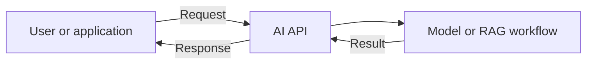
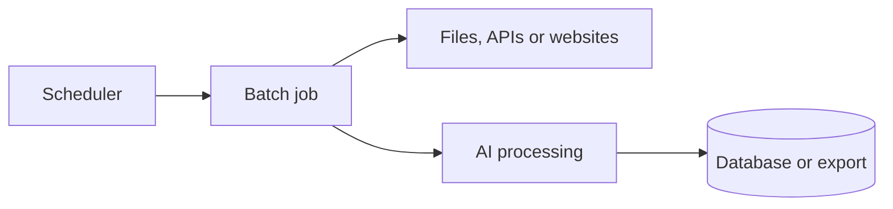
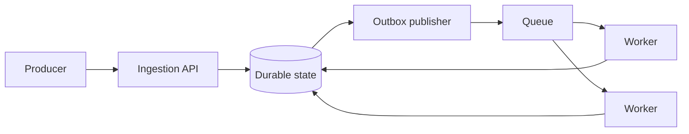
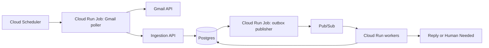

# Architecture Patterns for AI Systems

**Status:** Draft
**Author:** AI Architect course team
**Date:** 2026-07-11

## Summary

AI systems do not all need the same architecture.
A chat assistant, a nightly crawler, and an automated support service have different timing, scale, and failure requirements.

This design defines three useful execution patterns:

1. Request-response for interactive work.
2. Scheduled batch for finite work that runs periodically.
3. Queued event processing for independent work that needs buffering, retries, or horizontal scaling.

Webhooks and polling are ways to discover or submit work, not complete architectures by themselves.
A scheduled poller can process a batch directly or turn each discovered item into an event for queued workers.

## Goals

- Give students a simple vocabulary for common AI system architectures.
- Show when each pattern is appropriate through concrete examples.
- Make latency, reliability, scale, and operational cost part of the decision.
- Define the architecture used by the course support system.

## Non-goals

- Prescribe one architecture for every AI application.
- Cover every cloud product or distributed-systems pattern.
- Define low-level database schemas or APIs.

## Start with three decisions

Choose how the work executes, what triggers it, and how it accesses source data separately.

| Decision | Options |
|---|---|
| How does work execute? | Request-response, scheduled batch, queued processing |
| What triggers the work? | Direct request, webhook, schedule |
| How does it access source data? | Payload supplied by caller, poll or fetch from source |

These choices can be combined.
For example, a scheduled poller can discover emails and submit them to a queued support system.

## Pattern 1: Request-response

The caller waits while the system produces an answer.



Typical examples include chat assistants, interactive RAG, autocomplete, and short classifications.

This is the simplest pattern and gives the caller an immediate result.
It becomes a poor fit when work is long-running, must survive timeouts, or performs actions that are unsafe to repeat.

Use it when the user needs an answer now and the work can finish within the request.

## Pattern 2: Scheduled batch

A scheduler starts a finite job that processes a known search, file set, table, or time window and then exits.



Typical examples include daily search crawlers, nightly document ingestion, periodic CRM enrichment, market research, and report generation.

Batch jobs are simple to deploy, naturally limit cost, and are easy to rerun.
They become harder to manage when one slow item holds up the batch, jobs overlap, or individual items need separate retries and scaling.

Use this pattern when the work is finite, delay is acceptable, and the batch can be operated as one unit.

## Pattern 3: Queued event processing

A producer submits work, a queue buffers it, and workers process items independently.



Typical examples include customer support automation, ticket processing, document-processing platforms, transaction monitoring, and high-volume AI enrichment.

Queues absorb bursts, distribute work across workers, and allow each item to retry independently.
The tradeoff is more infrastructure, duplicate delivery, and extra care around database writes and external actions.

Use this pattern when independent work needs buffering, reliable retries, or horizontal scaling.

## Triggers and source access

Triggers start work.
The source data can arrive with the trigger or be fetched afterwards.

| Trigger | What happens | Example |
|---|---|---|
| Direct request | A client calls an API with work | User submits a document |
| Webhook | Another system calls an API after a change | Ticket system supplies a new comment |
| Schedule | A timer starts known work | Run a crawler or Gmail poller |

A webhook is an event producer, not the event-processing architecture itself.
The receiving API might process synchronously, start a batch, or place the work on a queue.

Polling is a source-access operation usually started by a schedule.
It does not imply one processing model:

```text
Poll -> process the complete result as one batch

Poll -> submit each result to a queue for independent processing
```

The first option is simpler.
The second is useful when discovered items need individual retries or scalable workers.

## How to choose

| Question | Request-response | Scheduled batch | Queued processing |
|---|---|---|---|
| Does someone need the result now? | Yes | No | No |
| Is the work a finite scheduled set? | Rarely | Yes | Sometimes |
| Does each item need its own retry? | Rarely | Sometimes | Usually |
| Must processing absorb bursts? | Sometimes | Rarely | Yes |
| Must workers scale independently? | Sometimes | Rarely | Yes |
| Is minimum infrastructure the priority? | Yes | Yes | No |

The decision can usually be made with three questions:

```text
Does the caller need to wait for the answer?
-> Use request-response.

Can the work run periodically as one finite unit?
-> Use scheduled batch.

Do independent items need buffering, retries, or scalable workers?
-> Use queued event processing.
```

Do not add a queue only because the system uses AI.
Add it when the work benefits from queue semantics.

## Proposed course support system

Customer email does not require an instant response, but every message is an independent customer-facing unit of work.
The support system therefore combines scheduled polling with queued event processing.



| Component | Responsibility |
|---|---|
| Gmail poller | Discover new messages every five minutes and submit them to the API |
| Ingestion API | Validate and durably accept support requests |
| Postgres | Store tickets, messages, events, processing state, and outcomes |
| Outbox publisher | Run every minute and publish accepted events after the database transaction |
| Pub/Sub | Buffer events and distribute them across workers |
| Support worker | Run classification, retrieval, drafting, and safety checks |
| Gmail adapter | Send approved replies or apply `Human Needed` |

The API stores the request and outbox record in one transaction before returning `202 Accepted`.
This prevents work from being lost between the database write and queue publication.

The outbox publisher is a scheduled Cloud Run Job.
It publishes pending records, marks successful deliveries, and exits.

Pub/Sub messages contain an event identifier rather than the full customer message.
Workers load the accepted request from Postgres, which remains the source of truth.

Gmail is one channel, not the business domain.
A ticket webhook or local test request can call the same ingestion API and use the same support workflow.

The Gmail poller advances its cursor only after the API durably accepts every message in that range.
The API enforces a unique source and message idempotency key, so retrying a partial polling run cannot create duplicate tickets.

```text
Gmail poller ---------\
Ticket webhook --------> ingestion API -> queue -> support workers
Local test request ----/
```

## Local development

Students should not need cloud infrastructure to develop the AI workflow.

```text
Unit test          Call the workflow with a typed support request.
Local system       POST a fixture to the API and run the handler inline.
Cloud integration Use a development Pub/Sub topic.
End-to-end         Poll a real Gmail inbox and observe the final action.
```

## Alternatives and tradeoffs

### Gmail push notifications

Gmail push offers lower latency but adds watch registration, renewal, and notification handling.
Five-minute polling meets the requirement with less operational complexity.

### Poller publishing directly to Pub/Sub

Direct publication removes an HTTP hop.
The API is retained because it provides one durable acceptance boundary for Gmail, ticket systems, and local tests.

### Process the Gmail batch without a queue

This would be simpler at low volume.
It is not selected because independent retries and scalable workers are important lessons for customer-facing automation.

## Risks

- Queues may deliver duplicates, so events and actions require idempotency keys.
- Polling jobs may overlap, so the Gmail cursor requires a lock or lease and advances only after durable API acceptance.
- External sends can have uncertain outcomes and must be reconciled before retrying.
- Unpublished outbox records and queue depth require monitoring.
- Customer messages need explicit access and retention policies.

## Rollout

1. Teach the three patterns with local examples.
2. Define the canonical support-request contract.
3. Add Postgres persistence and the ingestion API.
4. Add the outbox publisher, Pub/Sub, and workers.
5. Add the scheduled Gmail poller and Gmail action adapter.
6. Add retries, observability, evals, and deployment.

## Open questions

- Which Gmail authentication approach is simplest for the course inbox?
- How long should customer messages and agent traces be retained?

## Decision
