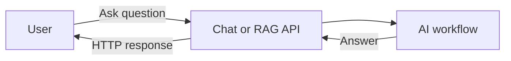
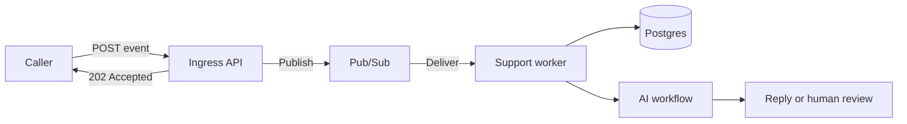
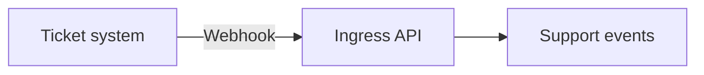
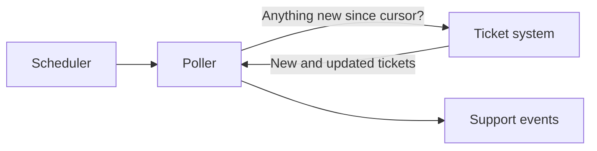
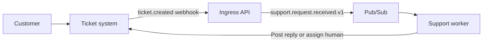
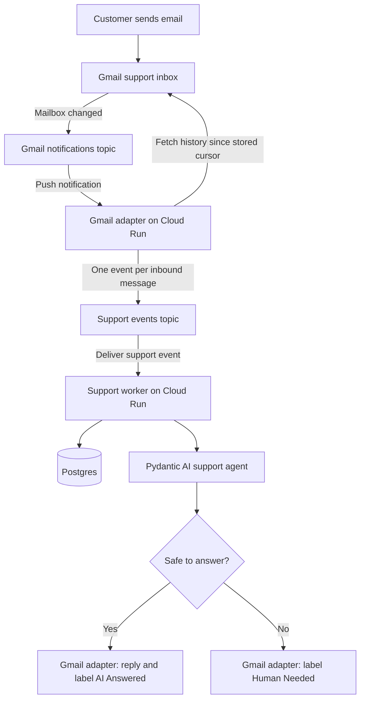
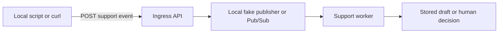

# How the Support System Works

A chat application is easy to picture because a person sends a message and waits for an answer.
A support system is less obvious because work can arrive while nobody is watching, and the answer may be produced later.

This document explains the main architecture types, where polling fits, and how our Gmail support system works.

## Start with two questions

The simplest mental model is to ask two separate questions:

1. Does the caller wait for the work to finish?
2. How does the system discover new work?

The first question separates request-response systems from asynchronous systems.
The second separates push notifications from polling.

| Question | Option one | Option two |
|---|---|---|
| Does the caller wait? | Request-response | Asynchronous processing |
| How is work discovered? | Push notification | Polling |

Polling is therefore not a third kind of processing system.
It is one way to discover work that will usually be processed asynchronously.

## Request-response systems make the caller wait

In a request-response system, the caller keeps the connection open until the answer is ready.



This works well for chat, interactive RAG, and short model calls.
It becomes awkward when processing takes a long time or must survive temporary failures.

## Asynchronous systems accept work for later

In an asynchronous system, the API accepts the work and returns before the AI workflow finishes.



The queue separates accepting the work from doing the work.
If processing fails, the message can be delivered again.
The worker must therefore recognise duplicate events and avoid sending duplicate replies.

An API is an HTTP interface.
A worker is a responsibility.
With a Pub/Sub push subscription, Pub/Sub calls a private HTTP endpoint on Cloud Run, so the worker is technically an API endpoint even though no customer calls it directly.

## Push and polling discover the same work differently

With push delivery, the source tells us when something changes.



With polling, our application asks the source what changed since its last check.



Both paths should produce the same internal event.
The rest of the system should not know how the work was discovered.

Webhooks are usually the primary trigger because they are quick and avoid repeated checks.
Polling is appropriate when a source has no webhook.
A slow reconciliation poll can also find work missed during an outage.

## The system is about support tickets, not email

Our business object is a support request.
Email is only the first channel through which a request arrives.

Every channel is converted into the same event shape:

```json
{
  "type": "support.request.received.v1",
  "event_id": "01J...",
  "channel": "email",
  "account_id": "support@example.com",
  "conversation_id": "gmail-thread-id",
  "external_id": "gmail-message-id",
  "idempotency_key": "gmail:support@example.com:message:abc123:received",
  "sender": "customer@example.com",
  "subject": "Refund question",
  "body": "Can I return an opened item?",
  "occurred_at": "2026-07-11T10:30:00Z"
}
```

A ticket webhook, a local script, and Gmail can all create this event.
The core support workflow only understands support events, so adding another channel does not change its classification, retrieval, drafting, or safety checks.
Inbound and outbound channel adapters still differ because Gmail sends replies differently from a ticketing system.

`event_id` identifies this event occurrence.
`conversation_id` groups messages that belong to the same Gmail thread or support ticket.
`external_id` identifies one message, comment, or source event inside that conversation.
`idempotency_key` identifies the business action and stays the same when a webhook or Pub/Sub message is retried.
Postgres enforces a unique constraint on the idempotency key so a retry cannot start the same workflow twice.

That constraint cannot guarantee exactly one external email.
A worker could send a reply and crash before recording that it succeeded.
Before sending, the worker creates an outbound action with its own unique key; after sending, it records the Gmail message identifier.
If a send has an uncertain result, the worker checks Gmail Sent before retrying it.

## A ticketing-system integration uses a webhook

A system such as Zendesk would normally call our API when a ticket is created or updated.



The webhook endpoint verifies the sender, normalises the payload, publishes the event, and returns quickly.
It does not run the model while the ticketing system waits.
The adapter emits an event only for a new customer-authored message or comment.
It ignores assignments, status changes, internal notes, and replies created by our own integration so it cannot create a reply loop.
The ticket identifier becomes `conversation_id`, while the individual comment or message identifier becomes `external_id`.

We do not need a real ticketing product to teach this flow.
During early lessons, a course-only endpoint can accept a canonical support event directly from a script or HTTP client.
A production public endpoint accepts the support request and creates trusted metadata such as the event type, identifier, idempotency key, and timestamp itself.
Building a mock Zendesk interface would add frontend work without teaching more about the AI system.

## Gmail publishes mailbox changes to Pub/Sub

Gmail differs from a normal ticket webhook.
After we register a Gmail watch, Gmail publishes mailbox-change notifications directly to a Google Cloud Pub/Sub topic.



The first Gmail notification does not contain the complete email.
It identifies the mailbox and its latest history position.
One notification can represent several mailbox changes.
The Gmail adapter asks the Gmail API for every history page since its stored cursor and publishes one support event for each qualifying inbound message.
It advances the cursor only after those events have been published successfully.

The support worker then:

1. Stores the event and support ticket in Postgres.
2. Ignores the event if its idempotency key was already processed.
3. Classifies the request.
4. Retrieves trusted support documents.
5. Drafts and checks an answer.
6. Sends the reply or leaves the ticket for a human.
7. Records the outcome.

Gmail notifications can be duplicated, watches must be renewed, history results can be paginated, and our own replies can produce more mailbox changes.
The adapter must store its history cursor, renew the watch, process all pages, and ignore messages sent by the support account.
These are real production concerns and useful lessons, but they stay outside the support agent itself.

## One codebase can have two service roles

The course does not need two unrelated applications.
It needs one Python codebase with two clear responsibilities:

| Service role | Responsibility |
|---|---|
| Ingress | Receive direct events, ticket webhooks, or Gmail notifications and publish canonical support events |
| Worker | Consume canonical events, run the support workflow, and record the outcome |

They can run together during early local lessons.
In production, the same container image can be deployed as two Cloud Run services so each role can scale and fail independently.
Pub/Sub and Postgres are managed infrastructure rather than more application code for students to build.

## We can build and test the backend before Gmail

The first working version needs no Gmail account and no mock ticketing interface.



Tests can call the event handler directly with a typed Python object.
A local command can submit a JSON event through HTTP.
An integration test can publish the same JSON to a test Pub/Sub topic.

When Gmail is connected later, the core support workflow stays unchanged.
The Gmail input and output adapters handle mailbox-specific behaviour around it.

## Putting it together

The course should build a channel-neutral support system and use Gmail for the final real-world demonstration.

The recommended progression is:

1. Send a support question directly into a synchronous Python workflow.
2. Define the canonical support event.
3. Submit that event through an API and process it in the background.
4. Store ticket state and processing attempts in Postgres.
5. Replace the local publisher with Pub/Sub.
6. Connect Gmail as the first real channel.
7. Add retries, duplicate protection, human review, evals, and observability.

Gmail is messier than a fake ticket form, but it gives the course a real input, a real customer-facing action, and a familiar human-review interface through labels.
The direct event API keeps the earlier lessons simple and proves that the backend is not coupled to Gmail.

## Try it

Take one support question and write it as a `support.request.received.v1` JSON event.
Then trace where that same event would come from in three cases: a direct API call, a ticket webhook, and Gmail.

The channel adapters change, but the core support workflow does not.
