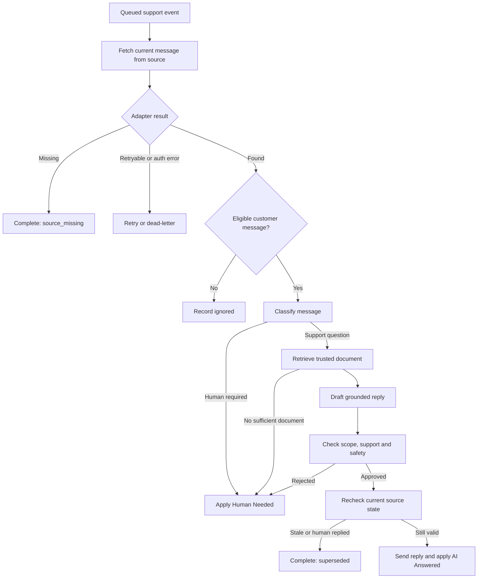
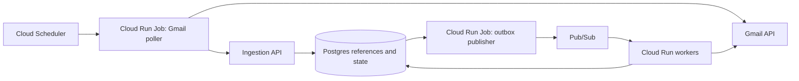

# AI Support Autoresponder

**Status:** Approved
**Owner:** AI Architect course team
**Decision date:** 2026-07-11

## Summary

The course builds an AI support autoresponder for a shared Gmail inbox.
It answers common questions from trusted support documents and leaves difficult, risky, or unrelated messages for a human.

The customer experience is simple:

```text
Customer sends a common support question
-> receives a useful answer quickly

Customer sends something the AI should not handle
-> receives no automated reply
-> support team sees Human Needed
```

Gmail is the first channel and remains the source of truth for message content.
The same system can later use a ticketing platform as the source of truth.

## Goals

- Reduce repetitive support work.
- Give customers faster answers to common questions.
- Answer only from trusted business documents.
- Leave uncertain or sensitive work for a human.
- Make every automated decision inspectable and retryable.
- Teach an API, durable state, queue, scalable workers, retrieval, guardrails, evals, and deployment.

## Non-goals

- Replace Gmail with a custom support dashboard.
- Store complete emails, ticket bodies, or attachments in Postgres.
- Process attachments automatically in the first version.
- Look up private orders or customer accounts.
- Issue refunds, cancel orders, or change account state.
- Use Gmail push notifications in the main course path.
- Require vector search in the finished application.

## State model

The system keeps eligibility, classification, decision, and completion separate.
This makes each value answer one clear question.

| Stage | Values | Question answered |
|---|---|---|
| Eligibility | `process`, `ignore` | Is this a new customer-authored message the system should consider? |
| Classification | `support_question`, `human_required` | Is this a support question that may be answered from trusted documents? |
| Decision | `reply`, `human_review` | What action did retrieval and guardrails approve? |
| Processing status | `accepted`, `processing`, `retry_pending`, `completed`, `dead_lettered` | Is work queued, running, retryable, or finished? |
| Completion | `replied`, `escalated`, `ignored`, `superseded`, `source_missing` | How did completed processing finish? |

`other` is not used because it does not tell the application what to do.

Deterministic checks ignore messages sent by the support account, bounces, bulk notifications, previously processed messages, and obvious automated loops before calling a model.
The model classifier assigns each remaining customer message to `support_question` or `human_required`.
An off-topic customer message requires human review rather than being silently ignored.

`superseded` means the source still exists but a human reply, newer customer message, or changed source revision makes the proposed action stale.
`source_missing` means the source was deleted or is no longer accessible.
Neither outcome applies a human-review label.

## Supported questions

The AI may answer common questions covered by trusted documents, such as:

- refund eligibility and process
- cancellation policy
- shipping policy
- opening hours
- warranty policy
- product setup and basic troubleshooting
- privacy or account guidance that does not require private customer data

The AI must require a human when:

- no relevant support document exists
- documents conflict or do not fully support the answer
- the request needs private account or order data
- the customer asks the system to perform an account or financial action
- the message is sensitive, threatening, legally significant, or unusual
- the draft contains unsupported claims
- the message contains a non-text MIME part

Human review is a normal product outcome, not a failed AI run.

## Workflow



The Pydantic AI agent retrieves trusted context and returns a typed decision.
It does not send email or apply labels itself.
Deterministic application code records and performs external actions after the final source-state check.

Every source adapter returns one of `found`, `missing`, `retryable_error`, or `authentication_error`.
Only a definitive not-found response produces `source_missing`.
Timeouts, rate limits, token failures, and server errors are retryable failures and never complete the event as missing.

## Reply behaviour

When a reply is approved:

1. Record a pending outbound action with a stable idempotency key.
2. Generate and persist a deterministic RFC `Message-ID` from the action identifier and an owned domain.
3. Send the reply in the original thread and record the Gmail message identifier.
4. Apply the `AI Answered` label as a separate action step.
5. Mark the support event `replied` only when both steps succeed.

Example:

```text
Hi Sarah,

Sorry to hear your order arrived damaged.

You can request a refund by visiting the returns page and entering your
order number. Eligible items can be returned within 30 days of delivery.

Thanks,
Customer Support
```

When a human is required:

1. Do not send a customer reply.
2. Apply the `Human Needed` label.
3. Record the reason and complete the event as escalated.

`outbound_actions` tracks `send_status` and `label_status` separately.
If sending has an uncertain result, the worker searches Gmail for the deterministic RFC `Message-ID` before retrying.
If the message exists, it records the send as successful and retries only the label step.
This prevents a label failure or network timeout from sending the same reply twice.

An uncertain send uses `send_status=unknown`.
The worker performs two reconciliation searches at least 60 seconds apart and does not resend after an unsuccessful search.
If neither search can prove the result, the event becomes `dead_lettered`, no further email is sent, and an operator alert includes the action identifier for manual reconciliation.

The application creates the `AI Answered` and `Human Needed` Gmail labels during setup.
It applies labels to the thread and removes the opposite automation label first, so the labels are mutually exclusive.
A human handles escalated threads in Gmail, replies normally, and removes `Human Needed` when the work is complete.
The system never auto-replies to a thread carrying `Human Needed`.

## Retrieval

Support documents are authored as Markdown files in `docs/policies` and loaded into the Postgres `support_documents` table.

Each document contains:

```text
id
title
category
summary
keywords
body
is_active
updated_at
```

The agent first inspects the known document index, then selects exactly one active document and loads it.
It may answer only from that trusted content.
No suitable document, multiple plausible documents, or conflicting documents results in `human_review`.

SQL document lookup is the default finished-app retrieval strategy because the policy set is small and known.
Vector and hybrid retrieval remain separate teaching examples for larger or messier knowledge bases.

## System architecture



### Gmail poller

The poller runs every five minutes.
It discovers every newly added inbox message and sends only source identifiers and trusted event metadata to the ingestion API.
Channel producers may filter transport events that cannot represent a new customer message, such as label changes or ticket assignment changes.
For every submitted message reference, the worker alone decides eligibility and records `ignored` outcomes.
It advances its Gmail cursor only after every message in the range is durably accepted.

On first setup, the poller records the mailbox's current Gmail history identifier and an activation timestamp.
It does not process the existing inbox.
Later runs page through Gmail history from the stored cursor and process only new messages in `INBOX`.

Gmail can expire an old history cursor.
If this happens, the poller performs a bounded resync by listing inbox messages newer than the last successful poll, submits their references through the idempotent API, and stores a fresh history identifier.
Only one poller may hold the account cursor lease at a time.
The cursor lease lasts 10 minutes, longer than the five-minute poller timeout.

### Ingestion API

The API validates the source reference and enforces a unique `(source, account_id, message_id, event_type)` key.
In one transaction it stores the support event and outbox record, then returns `202 Accepted` with the event identifier.

The canonical request is:

```json
{
  "source": "gmail",
  "account_id": "support@example.com",
  "conversation_id": "gmail-thread-id",
  "message_id": "gmail-message-id",
  "source_event_id": "optional-history-or-webhook-id",
  "source_revision": "optional-source-revision",
  "observed_at": "2026-07-11T10:00:00Z"
}
```

`source` is one of `gmail`, `ticket`, or `fixture`.
The first four fields are required and source event, revision, and observation time are optional.
The caller cannot choose the internal event identifier, event type, processing status, creation time, or idempotency key.
The API generates those fields and always creates `support.message.detected.v1`.

### Outbox publisher

The publisher runs every minute, claims pending outbox records with an expiring lease, publishes event identifiers to Pub/Sub, records successful publication, and exits.
This prevents accepted work from being stranded between Postgres and Pub/Sub.
An expired lease makes the record available to another publisher run.
The outbox lease lasts five minutes and the publisher job times out after three minutes.

### Support workers

Pub/Sub invokes workers with an event identifier.
A worker atomically claims the event with `lease_owner` and `lease_expires_at`, fetches the current message through the source adapter, runs the support workflow, performs the deterministic channel action, and records the outcome.
An expired worker lease makes the event retryable.

The claim lease lasts 15 minutes and the worker enforces a 10-minute workflow timeout.
The worker does not need lease renewal in the first version.

The Pub/Sub endpoint returns `2xx` for completed events and events the application has deliberately dead-lettered.
If another worker holds an active lease, it returns a retryable `5xx` so a delivery remains available if the first worker crashes.
It records `retry_pending` and returns `5xx` for retryable source, model, database, or channel failures so Pub/Sub redelivers with backoff.
After five application attempts, it records `dead_lettered`, acknowledges the message, and emits an operator alert.
The Pub/Sub subscription also uses a dead-letter topic with 10 delivery attempts as a backstop for malformed requests or failures outside application handling.
A monitored dead-letter subscription records or reconciles these backstop failures against `support_events`.

Workers may scale horizontally.
The event lease prevents concurrent duplicate model work.
A retry after a crashed model call may repeat that call, but idempotent outbound actions must still prevent duplicate customer actions.

## Source references

Postgres stores automation state rather than customer content.

```text
support_events
--------------
event_id
event_type
source
account_id
conversation_id
message_id
source_event_id
source_revision
idempotency_key
status
attempt_count
lease_owner
lease_expires_at
eligibility
classification
selected_document_id
decision
decision_reason
completion_outcome
external_action_id
last_error
created_at
completed_at
```

Required Gmail references are `source`, `account_id`, `conversation_id` as the Gmail thread ID, and `message_id`.
`source_event_id` records the Gmail history record when available and `source_revision` records the observed history identifier.

Fixture references use a fixture collection, conversation identifier, and fixture message identifier.
Ticket references use the tenant, ticket identifier, comment identifier, source event identifier, and source revision.

The worker fetches the current email body and attachment metadata from Gmail when processing begins.
It rechecks the thread before sending to make sure no human or newer customer message has made the draft stale.

The queue payload contains only:

```json
{
  "event_id": "event-123",
  "event_type": "support.message.detected.v1"
}
```

## Attachments

Attachments remain in Gmail or the ticketing platform.
The first version inspects MIME metadata but does not download, store, or process attachment bytes.
Any MIME leaf part other than `text/plain` or `text/html` makes the message `human_required`.
Multipart containers do not count as content parts.
This deliberately escalates inline images as well as file attachments so the rule is mechanical and safe.

Attachment extraction can be added later behind the source-adapter boundary.

## Ticket-system adaptation

A modern ticketing platform calls a webhook when a customer creates a ticket or adds a public customer comment.
The adapter verifies the webhook signature before accepting it.
The producer accepts only ticket-created and public-customer-comment event types.
It filters internal-note, assignment, status, integration, and human-outbound event types before ingestion because they are not candidate customer messages.
The worker still owns eligibility for every message reference the producer submits.
The webhook adapter stores the ticket and comment identifiers through the same ingestion service.
The worker fetches the current ticket content before processing and rechecks it before posting a reply.

The webhook event identifier prevents duplicate ingestion.
The source-message key prevents two webhook events for the same customer comment from creating duplicate work.

```text
Gmail poller ---------\
Ticket webhook --------> accept support reference -> queue -> support worker
Local fixture --------/
```

For a platform without reliable webhooks, a scheduled ticket poller can submit the same references.
The first integration uses one primary mechanism per channel rather than building polling and webhooks together.

## Local development

The AI workflow remains independent from Gmail and Google Cloud.

```text
Unit test
-> pass a typed SupportMessage directly to the workflow

API and worker test
-> POST a source=fixture reference
-> fixture adapter loads a local JSON message by ID

Cloud integration
-> publish an accepted fixture event through a development Pub/Sub topic

End-to-end
-> poll a real Gmail inbox and observe the reply or label
```

## Minimal production data

```text
channel_cursors
support_events
outbox_events
support_documents
agent_runs
outbound_actions
eval_cases
eval_runs
eval_results
```

Production tables store source references, processing state, decisions, model metadata, errors, and external action identifiers.
They do not store complete email or ticket content by default.
Logs, traces, and model-call records must redact customer message bodies and attachment content.

Retention defaults are:

| Data | Retention |
|---|---|
| Published outbox records | 7 days |
| Application and access logs | 30 days |
| Completed and dead-lettered support events | 90 days |
| Agent runs and outbound actions | 90 days |
| Channel cursors | While the channel is active, then 30 days |
| Support documents | While active, with normal database backups |
| Synthetic eval fixtures and results | Keep with the course release |

A daily cleanup job deletes expired rows in dependency order.
Production customer messages must never be copied into eval fixtures.

## Technology choices

- Python and `uv` for course code.
- FastAPI for the ingestion API and Pub/Sub worker endpoint.
- Pydantic AI after the hand-built agent lesson.
- OpenAI as the default model provider, with direct Anthropic configuration demonstrated.
- Postgres and Cloud SQL for support documents and durable workflow state.
- Pub/Sub for buffering and worker delivery.
- Cloud Run Jobs for Gmail polling and outbox publishing.
- Cloud Run services for the API and workers.
- Gmail labels as the human-review interface.

## Gmail authentication

The course uses one Google Workspace support inbox.
It authorizes Gmail with the OAuth 2.0 authorization-code flow and offline access, then stores the client identifier, client secret, and refresh token in Secret Manager.
The app requests the `gmail.modify` scope so it can read messages, send replies, and manage labels.

For the course Workspace, configure the OAuth app as internal and have an administrator approve the access.
Domain-wide delegation and multiple support inboxes are later extensions, not first-version requirements.

## Evals

Eval cases use dedicated fixtures rather than production customer emails.
Each case records the input message and expected classification, document, action, and required answer points.

The suite checks:

- classification
- selected document
- reply versus human review
- grounded required points
- unsupported claims
- duplicate-action prevention

Humans review tone, clarity, and whether they would send the answer to a customer.

## Success criteria

- Common documented questions receive accurate grounded replies.
- Uncertain, sensitive, unsupported, and off-topic messages receive `Human Needed` and no reply.
- Automated and self-sent messages cannot create reply loops.
- Duplicate events cannot create duplicate customer replies.
- A deleted or changed source message fails safely.
- The same core workflow runs against fixtures, Gmail, and a future ticket adapter.
- Every event has inspectable status, attempts, decision, and external action identifiers.

## Implementation order

1. Lock typed inputs, classifications, decisions, and fixture cases.
2. Make the local Pydantic AI workflow pass the eval fixtures.
3. Add source references, event state, and the ingestion API.
4. Add the outbox publisher, Pub/Sub, and idempotent worker.
5. Add the Gmail source and action adapter.
6. Add Gmail polling, labels, retries, and stale-thread checks.
7. Add observability, deployment, and end-to-end verification.
